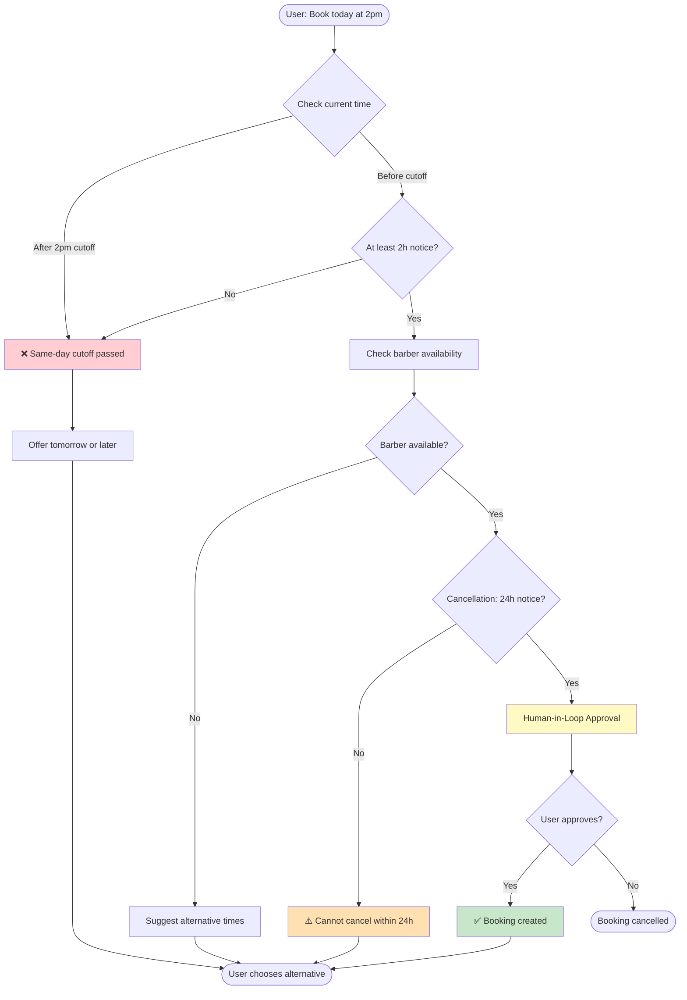

# 💈 Barbershop Booking Agent

AI-powered barbershop booking system with conversational interface, built on LangChain agents with FastAPI backend.

## Features

- **Conversational AI Agent**: Natural language booking interface powered by LangChain
- **Business Rules Enforcement**: Validates bookings (2-hour minimum notice, 24-hour cancellation policy)
- **Middleware Stack**: PII masking, usage tracking, context injection, human-in-the-loop
- **REST API**: FastAPI backend for customers, barbers, services, and bookings
- **Async SQLAlchemy**: Database layer with Alembic migrations

## Example Conversations

**Successful Bookings:**
- "Book a haircut with Donny tomorrow at 7pm" (with email: james.w@email.com)
- "I need a beard trim next Tuesday at 3pm with Tony"
- "Schedule me for a premium haircut on Friday afternoon"

**Policy Violations:**
- ❌ "Book a haircut today at 8pm" (after 2pm cutoff)
- ❌ "I need a haircut in 1 hour" (insufficient notice)
- ❌ "Book me for January 15th, 2026" (too far in advance)

**Cancellations:**
- ✅ "Cancel my booking next week" (>24 hours notice)
- ✅ "I need to cancel my appointment on November 18th"
- ❌ "Cancel my appointment tomorrow" (<24 hours notice)

**Updates:**
- ✅ "Move my appointment to Friday at 3pm" (valid future date)
- ✅ "Reschedule my booking to next Tuesday"
- ❌ "Change my booking to today at 5pm" (same-day after cutoff)

### Policy Enforcement Flow



## Documentation

Detailed documentation available in the `docs/` folder:

- **[ARCHITECTURE.md](docs/ARCHITECTURE.md)** - System architecture, tech stack, and design decisions
- **[AGENT_IMPLEMENTATIONS.md](docs/AGENT_IMPLEMENTATIONS.md)** - Agent implementation details and patterns
- **[MIDDLEWARE.md](docs/MIDDLEWARE.md)** - Middleware components and execution flow

## Development Setup

### Prerequisites

- Python 3.11+
- [uv](https://github.com/astral-sh/uv) (recommended) or pip
- OpenAI API key

### Installation

```bash
# Clone repository
git clone <repository-url>
cd barbershop

# Install dependencies with uv
uv sync

# Or with pip
pip install -e ".[dev]"

# Configure environment
cp .env.example .env
# Edit .env and add your OPENAI_API_KEY
```

### Database Setup

```bash
# Initialize database schema
uv run poe db-init

# Seed with sample data
uv run poe db-seed

# List all data
uv run poe db-list

# List specific entities
uv run poe db-list-customers
uv run poe db-list-barbers
uv run poe db-list-services
uv run poe db-list-availability
uv run poe db-list-bookings

# Clear and reseed
uv run poe db-seed-clear
```

## Running the Application

### Development Servers

```bash
# Start FastAPI backend (port 8005)
uv run poe dev-api

# Start Chainlit UI (port 8006)
uv run poe dev-ui

# Run CLI agent directly
uv run poe dev-agent

# Start both API and UI together
uv run poe dev-all
```

### Database Management

The project uses Alembic for database migrations with async SQLAlchemy support.

```bash
# Create new migration (after modifying models)
uv run poe db-migrate "description of changes"
# Or directly: uv run alembic revision --autogenerate -m "message"

# Apply migrations
uv run poe db-upgrade
# Or directly: uv run alembic upgrade head

# Rollback one migration
uv run poe db-downgrade
# Or directly: uv run alembic downgrade -1

# Check current migration version
uv run poe db-current

# View migration history
uv run poe db-history

# Reset database (downgrade + upgrade)
uv run poe db-reset
```

**Configuration:**
- `alembic.ini` - Alembic configuration file
- `alembic/env.py` - Async migration environment setup
- `alembic/versions/` - Migration scripts directory

**Best Practices:**
- Always create a migration after modifying database models
- Review auto-generated migrations before applying them
- Test migrations on a development database first
- Never modify migration files after they've been applied to production

## Testing

```bash
# Run all tests
uv run poe test

# Unit tests only
uv run poe test-unit

# Integration tests only
uv run poe test-integration

# Generate coverage report
uv run poe test-cov
```

## Code Quality

```bash
# Linting
uv run poe lint           # Check for issues
uv run poe lint-fix       # Auto-fix issues

# Formatting
uv run poe format         # Format code with black
uv run poe format-check   # Check formatting

# Type checking
uv run poe type-check     # Run mypy

# Combined quality checks
uv run poe quality        # format + lint-fix + type-check
uv run poe check          # format-check + lint + type-check + test
uv run poe pre-commit     # quality + test (run before committing)
```

## Pre-commit Hooks

Install pre-commit hooks for automatic code quality checks:

```bash
# Install pre-commit
pip install pre-commit

# Install git hooks
pre-commit install

# Run manually on all files
pre-commit run --all-files
```

Pre-commit hooks include:
- Ruff linting and formatting
- Black formatting
- MyPy type checking
- Trailing whitespace removal
- YAML/JSON validation
- Security scanning with Bandit

## CI/CD

GitHub Actions workflows are configured in `.github/workflows/`:

### Continuous Integration (CI)
Runs on push and pull requests:
- **Lint & Format**: Ruff and Black checks
- **Type Check**: MyPy static analysis
- **Tests**: Unit and integration tests (Python 3.11 & 3.12)
- **Security**: Bandit security scanning
- **Build**: Package build verification
- **CodeQL**: Security vulnerability scanning

### Continuous Deployment (CD)
Triggered by version tags (`v*.*.*`):
- **Build & Push**: Docker image to GitHub Container Registry
- **Deploy Staging**: Auto-deploy to staging environment
- **Deploy Production**: Deploy to production (requires approval)
- **Release**: Create GitHub release with changelog

**Trigger deployment**:
```bash
# Create and push version tag
git tag -a v1.0.0 -m "Release v1.0.0"
git push origin v1.0.0
```

## Docker

Build and run with Docker:

```bash
# Build image
docker build -t barbershop-agent .

# Run API server
docker run -p 8005:8005 -e OPENAI_API_KEY=sk-... barbershop-agent

# Run with docker-compose (create docker-compose.yml first)
docker-compose up
```

## Project Structure

```
barbershop/
├── src/
│   ├── agent/              # LangChain agent implementation
│   │   ├── middleware/     # Middleware components
│   │   ├── tools/          # Agent tools (booking, customer, etc.)
│   │   └── llm/            # LLM registry
│   ├── api/                # FastAPI application
│   │   ├── models/         # Database models & schemas
│   │   └── routers/        # API endpoints
│   ├── core/               # Core configuration
│   └── ui/                 # Chainlit chat interface
├── tests/
│   ├── unit/               # Unit tests
│   └── integration/        # Integration tests
├── docs/                   # Documentation
├── alembic/                # Database migrations
├── run.py                  # CLI agent runner
└── pyproject.toml          # Project configuration
```

## Middleware Stack

The agent uses the following middleware (in execution order):

1. **business_rules** - Enforces booking policies BEFORE tool execution:
   - 2-hour minimum notice for same-day bookings
   - 24-hour cancellation policy
   - Business hours validation
   - Maximum advance booking window (14 days)
2. **conversation_summary** - Trims conversation history to prevent context overflow
3. **PII masking** - Masks emails and credit card numbers before sending to LLM
4. **usage_tracking** - Tracks token consumption for monitoring
5. **human_in_the_loop** - Requires approval for sensitive operations (`create_booking`, `cancel_booking`, `update_booking`)

See [MIDDLEWARE.md](docs/MIDDLEWARE.md) for details.

## License

MIT License
