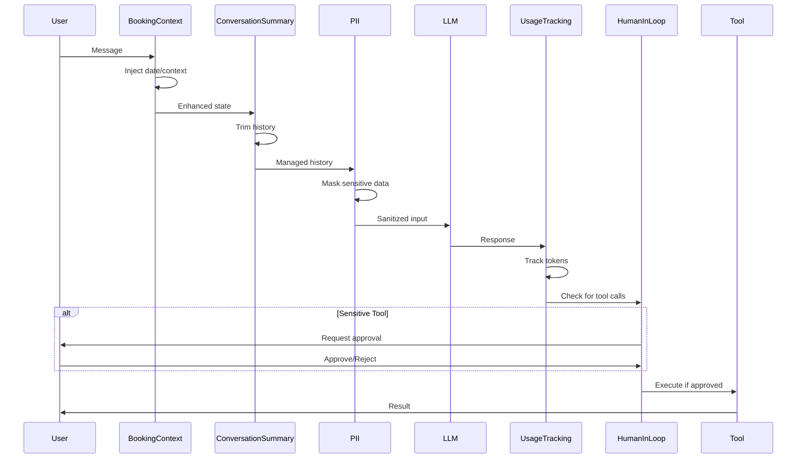

# Middleware Architecture

Middleware components that provide cross-cutting concerns for the booking agent using LangChain v1's middleware pattern.

## Middleware Stack

```mermaid
graph LR
    USER[User Input] --> BC[BookingContext]
    BC --> CS[ConversationSummary]
    CS --> PII[PII Masking]
    PII --> MODEL[LLM Call]
    MODEL --> UT[UsageTracking]
    UT --> HITL[HumanInLoop]
    HITL --> TOOL[Tool Execution]
    TOOL --> RESPONSE[Response]
    
    style BC fill:#e3f2fd
    style CS fill:#e3f2fd
    style PII fill:#fff3e0
    style UT fill:#f3e5f5
    style HITL fill:#ffcdd2
```



## Middleware Hooks

| Hook | When | Used By |
|------|------|---------|
| `before_model` | Before each LLM call | BookingContext, ConversationSummary, PII |
| `after_model` | After LLM response | UsageTracking, HumanInLoop |
| `wrap_tool_call` | Around tool execution | (Future: error handling) |

## Components

### BookingContextMiddleware
**Location**: `src/agent/middleware/booking_context.py`

Injects contextual information into agent state before LLM calls.

**Injects**:
- `current_date`: Today's date for time calculations
- `conversation_stage`: Tracks booking flow progress
- `business_name`: For personalized responses

```python
# Automatically adds to state
state["current_date"] = "2024-11-10"
state["business_name"] = "The Barbershop"
```

---

### ConversationSummaryMiddleware
**Location**: `src/agent/middleware/conversation_summary.py`

Manages conversation memory by trimming message history when it exceeds limits.

**Configuration**:
- `max_messages`: 20 (default)

**Behavior**:
- Preserves system messages
- Adds summary message for context
- Prevents token bloat in long conversations

---

### PIIMiddleware (Built-in)
**Location**: `langchain.agents.middleware.PIIMiddleware`

Redacts or masks Personally Identifiable Information before sending to LLM.

**Current Configuration**:
```python
PIIMiddleware("email", strategy="mask", apply_to_input=True)
PIIMiddleware("credit_card", strategy="mask", apply_to_input=True)
```

**PII Types**:
- `email`: Email addresses → `[MASKED_EMAIL]`
- `credit_card`: Card numbers → `****-****-****-1234`
- `ip`: IP addresses → `[MASKED_IP]`
- `mac_address`, `url`: Additional types available

**Strategies**:
- `mask`: Partially obscure (e.g., last 4 digits)
- `redact`: Replace with `[REDACTED_TYPE]`
- `hash`: Replace with deterministic hash
- `block`: Raise exception when detected

---

### UsageTrackingMiddleware
**Location**: `src/agent/middleware/usage_tracking.py`

Tracks LLM token consumption for monitoring and cost analysis.

**Tracks**:
- Input tokens
- Output tokens
- Total tokens per call
- Session totals

**Usage**:
```python
# Get current statistics
stats = usage_tracking_middleware.get_stats()
# {'total_input_tokens': 1200, 'total_output_tokens': 450, 'total_calls': 5}

# Reset for new session
usage_tracking_middleware.reset_stats()
```

---

### HumanInTheLoopMiddleware (Built-in)
**Location**: `langchain.agents.middleware.HumanInTheLoopMiddleware`

Pauses execution for human approval on sensitive operations.

**Configuration**:
```python
HumanInTheLoopMiddleware(
    interrupt_on={
        "create_booking": {"allowed_decisions": ["approve", "reject"]},
        "cancel_booking": {"allowed_decisions": ["approve", "reject"]},
        "modify_booking": {"allowed_decisions": ["approve", "reject"]},
    },
    description_prefix="Booking action pending approval"
)
```

**Flow**:
1. Agent decides to call sensitive tool
2. Execution pauses with `__interrupt__` flag
3. User reviews action details
4. User approves or rejects
5. Execution resumes or cancels

**Resumption**:
```python
from langchain_core.command import Command

# Approve and continue
agent.invoke(
    Command(resume={"decisions": [{"type": "approve"}]}),
    config={"configurable": {"thread_id": "session_123"}}
)
```

**Note**: Requires `MemorySaver` checkpointer for state persistence.

---

## Execution Order



## Testing

### Test PII Masking
```python
# Email
agent.invoke({"messages": [{"role": "user", "content": "Email: john@example.com"}]})
# LLM sees: "Email: [MASKED_EMAIL]"

# Credit card
agent.invoke({"messages": [{"role": "user", "content": "Card: 4532-1234-5678-9010"}]})
# LLM sees: "Card: ****-****-****-9010"
```

### Test Usage Tracking
```python
# Run conversation
agent.invoke({"messages": [...]})

# Check statistics
stats = usage_tracking_middleware.get_stats()
print(f"Total tokens: {stats['total_tokens']}")
print(f"Total calls: {stats['total_calls']}")
```

### Test Human-in-the-Loop
```python
# First call - triggers interrupt
result = agent.invoke(
    {"messages": [{"role": "user", "content": "Book me for tomorrow 2pm"}]},
    config={"configurable": {"thread_id": "test_123"}}
)

# Check interrupt
if "__interrupt__" in result:
    print(f"Pending: {result['__interrupt__']}")

# Resume with approval
result = agent.invoke(
    Command(resume={"decisions": [{"type": "approve"}]}),
    config={"configurable": {"thread_id": "test_123"}}
)
```

## Adding Custom Middleware

Extend `AgentMiddleware` and implement desired hooks:

```python
from langchain.agents.middleware import AgentMiddleware

class CustomMiddleware(AgentMiddleware):
    @property
    def name(self) -> str:
        return "custom_middleware"
    
    def before_model(self, state, config):
        # Modify state before LLM call
        state["custom_field"] = "value"
        return state
    
    def after_model(self, output, state, config):
        # Process LLM response
        print(f"Model generated: {output}")
        return output

# Add to agent
agent = create_agent(
    model=llm,
    tools=tools,
    middleware=[
        booking_context_middleware,
        CustomMiddleware(),  # Your middleware
        usage_tracking_middleware,
    ]
)
```
